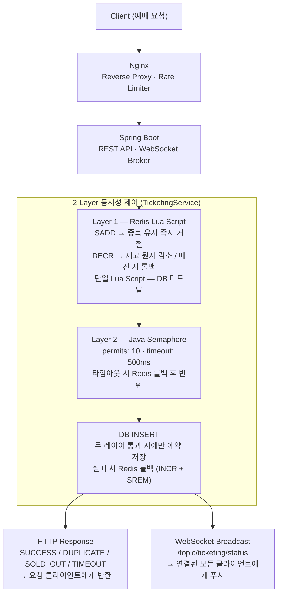

# Ticketing Demo

동시 요청 수에 관계없이 중복 예매 없이 안정적으로 처리되는 선착순 티켓팅 데모입니다.  
Redis Lua Script + Java Semaphore 2단계 동시성 제어로 DB에 도달하는 요청 수를 최소화하고,  
WebSocket(STOMP)으로 모든 클라이언트에 실시간 현황을 브로드캐스트합니다.  
Spring Boot + Redis + WebSocket + React, Docker Compose로 실행합니다.

## 기술 스택

| 레이어 | 기술 |
|--------|------|
| Backend | Spring Boot 3.2, Java 17, Spring Data JPA, Spring WebSocket (STOMP) |
| 동시성 제어 | Redis Lua Script, Java Semaphore |
| DB | H2 in-memory |
| Frontend | React 18, TypeScript, Vite, @stomp/stompjs |
| 인프라 | Docker, Nginx |

## 아키텍처



## 동시성 제어 2단계

아무리 많은 요청이 몰려도 각 레이어에서 불필요한 요청을 걸러내어 DB 부하를 최소화합니다.

```
[대규모 동시 요청]
       ↓
Layer 1 — Redis Lua Script (SADD + DECR, 원자적 실행)
  · 중복 사용자 차단 (SADD) → 즉시 거절, DB 미도달
  · 재고 0 이하 시 즉시 매진 처리 (DECR) → 즉시 거절, DB 미도달
       ↓ (재고 내 신규 요청만 통과)
Layer 2 — Java Semaphore (permits: 10)
  · DB 동시 접근 스레드 수 제한으로 커넥션 풀 보호
  · 500ms 내 획득 실패 시 TIMEOUT 반환 → Redis 롤백
       ↓ (세마포어 획득 성공 요청만 통과)
DB INSERT
  · 두 레이어를 통과한 성공 케이스만 저장
       ↓
HTTP Response (요청 클라이언트) + WebSocket Broadcast (전체 클라이언트)
```

## 실시간 현황

WebSocket(STOMP)으로 예매 현황을 실시간 구독합니다.  
예매 처리 시 서버가 `/topic/ticketing/status`로 현황을 브로드캐스트합니다.


## 실행

```bash
docker compose up -d --build
```

브라우저에서 `http://localhost:3000` 접속.

## 종료

```bash
docker compose down
```

## API

| Method | Path | 설명 |
|--------|------|------|
| GET | `/api/ticketing/status` | 현재 티켓팅 현황 |
| POST | `/api/ticketing/reserve` | 티켓 예매 요청 |
| POST | `/api/ticketing/reset` | 예매 초기화 |
| WS | `/ws` (STOMP) | 실시간 현황 구독 (`/topic/ticketing/status`) |
